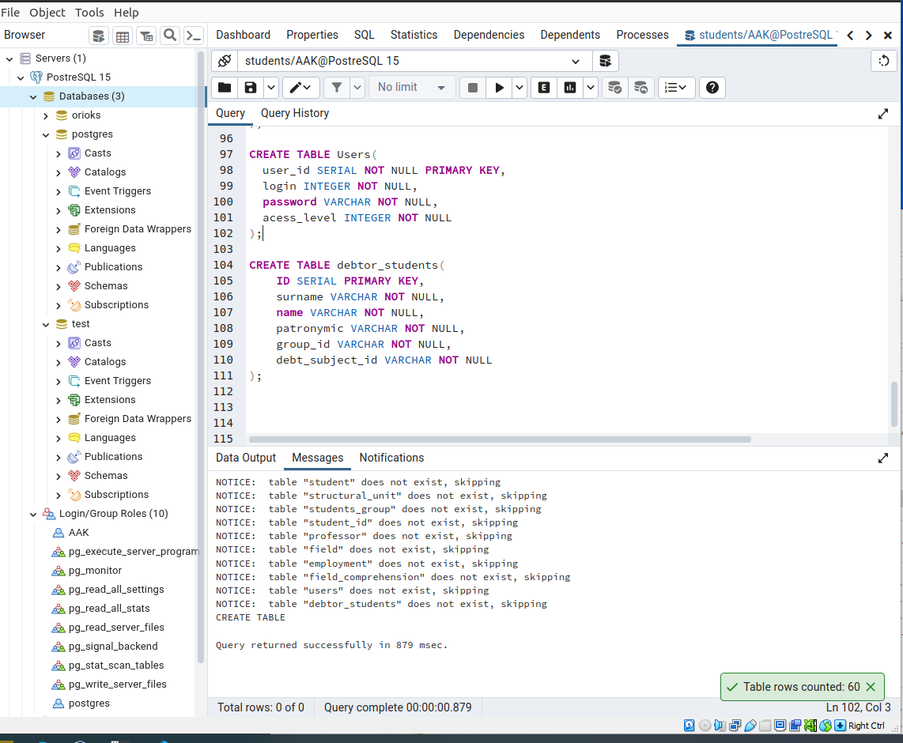
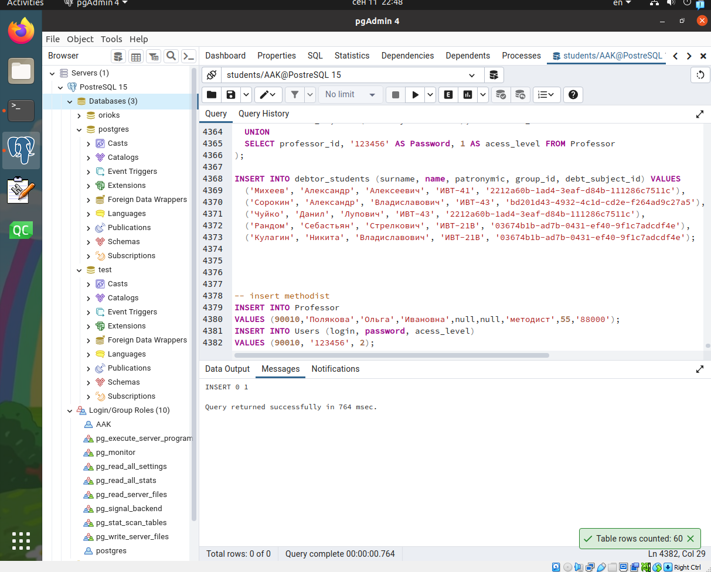
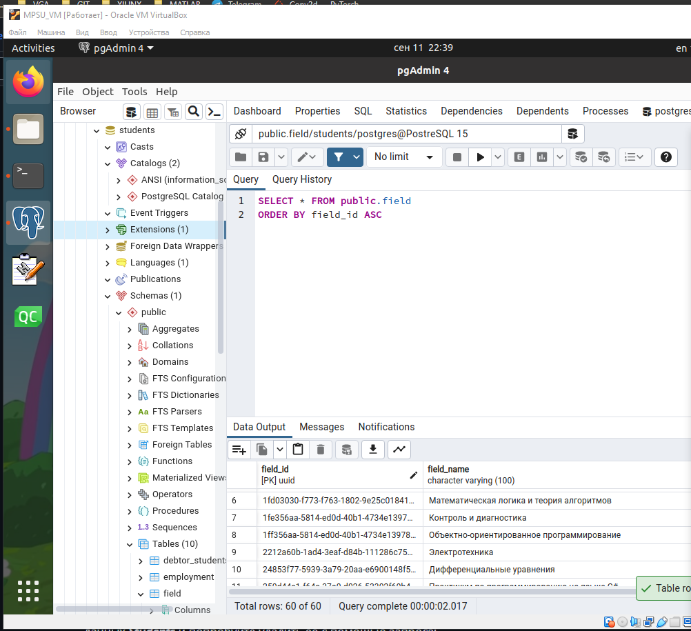
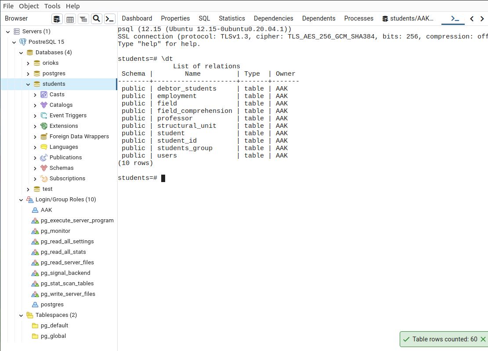
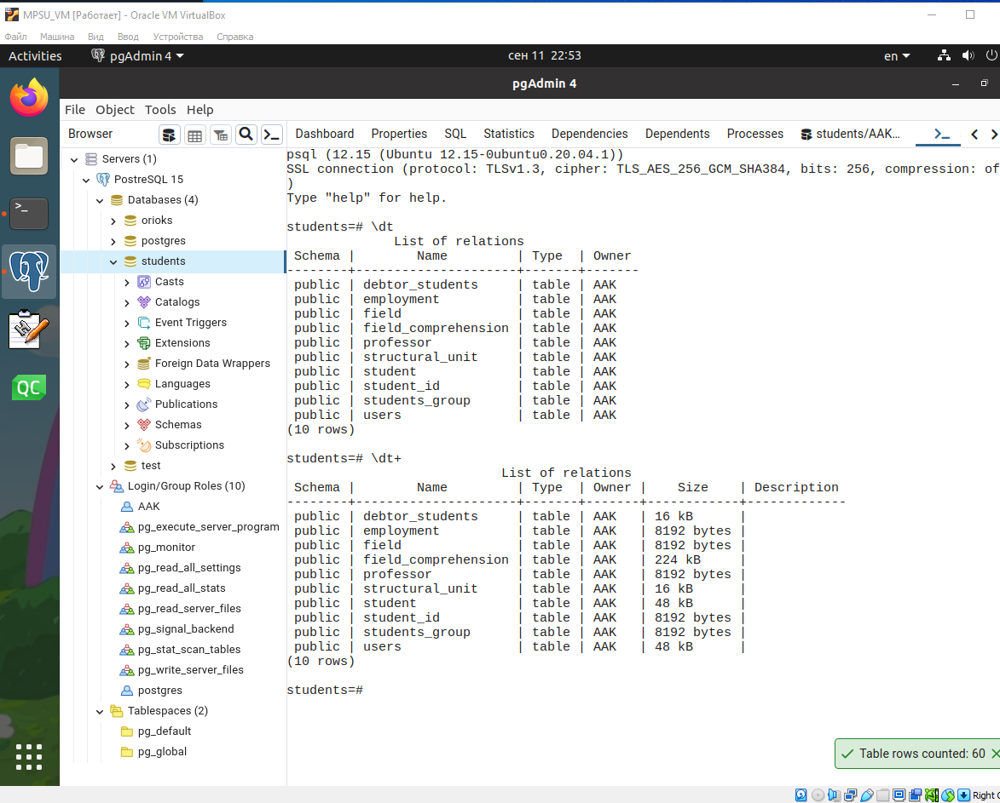
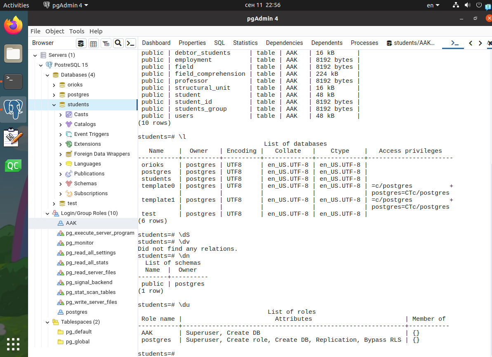
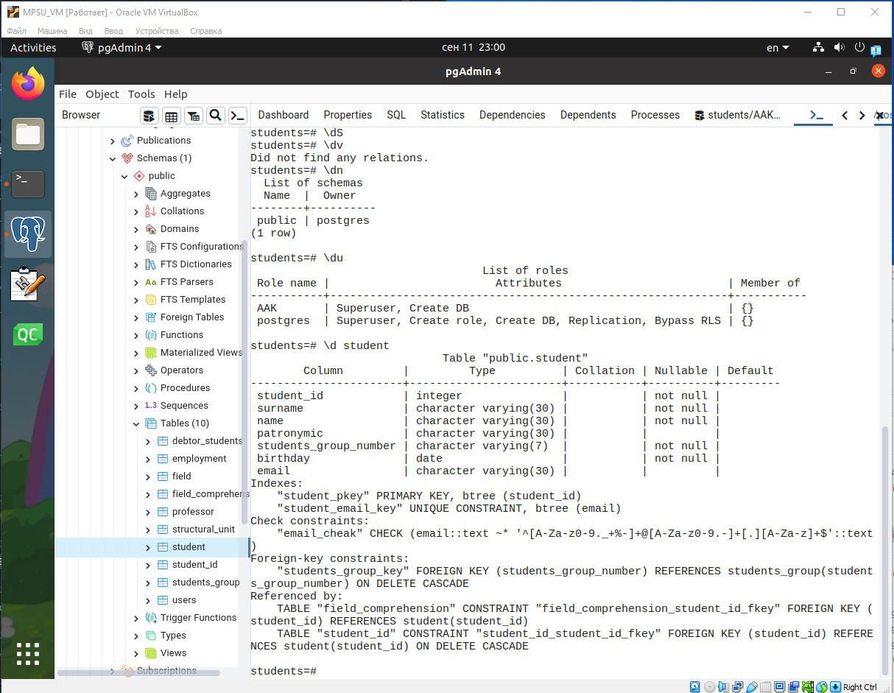
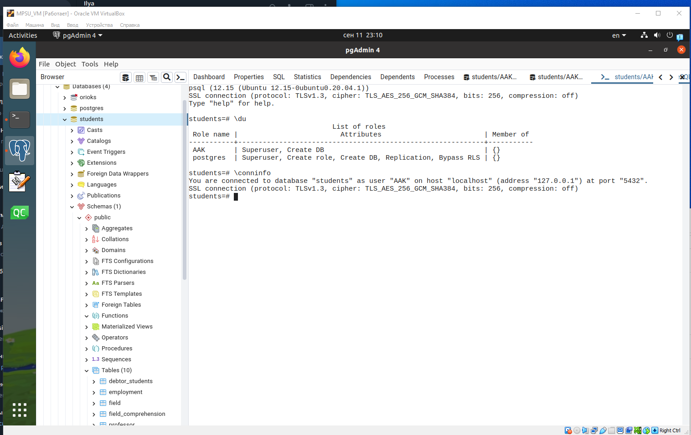

1. Задание 1.

    Создание базы данных

    create_db
    

    insert_students
    

    check_table
    

1. Задание 2.

    Работа с терминалом psql

    `\dt`
    

    `\dt+`
    
    Обратим внимание, что таблица `student` занимает `48 kB`.

    `\du`
    

    `\d student`
    

    Как я исправил роль на `AAK`
    

1. 
