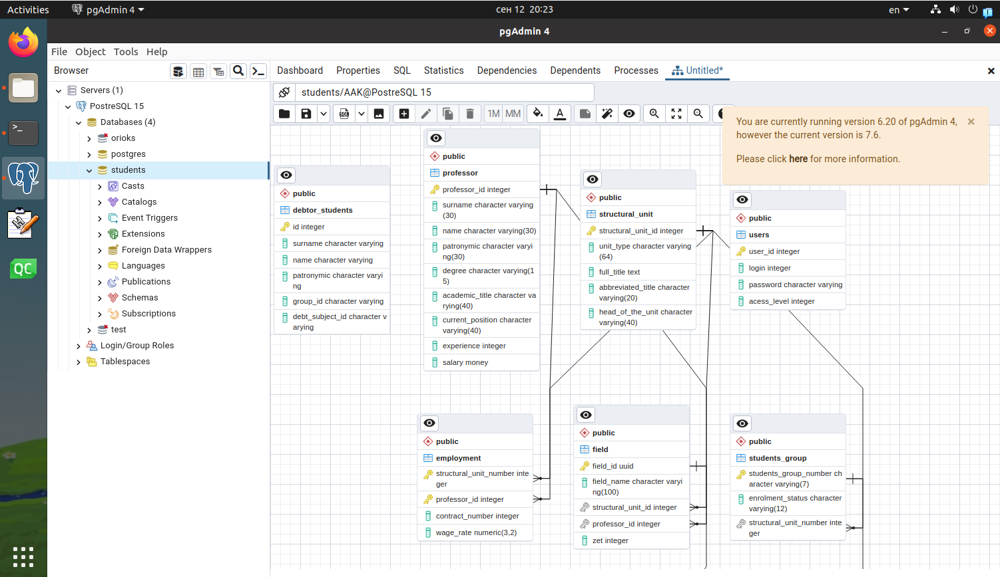
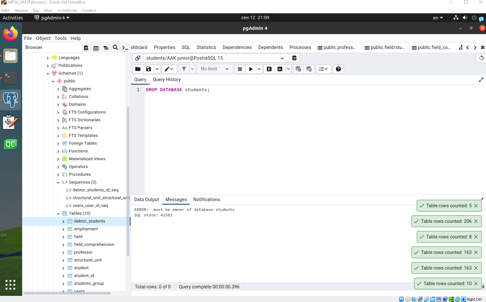
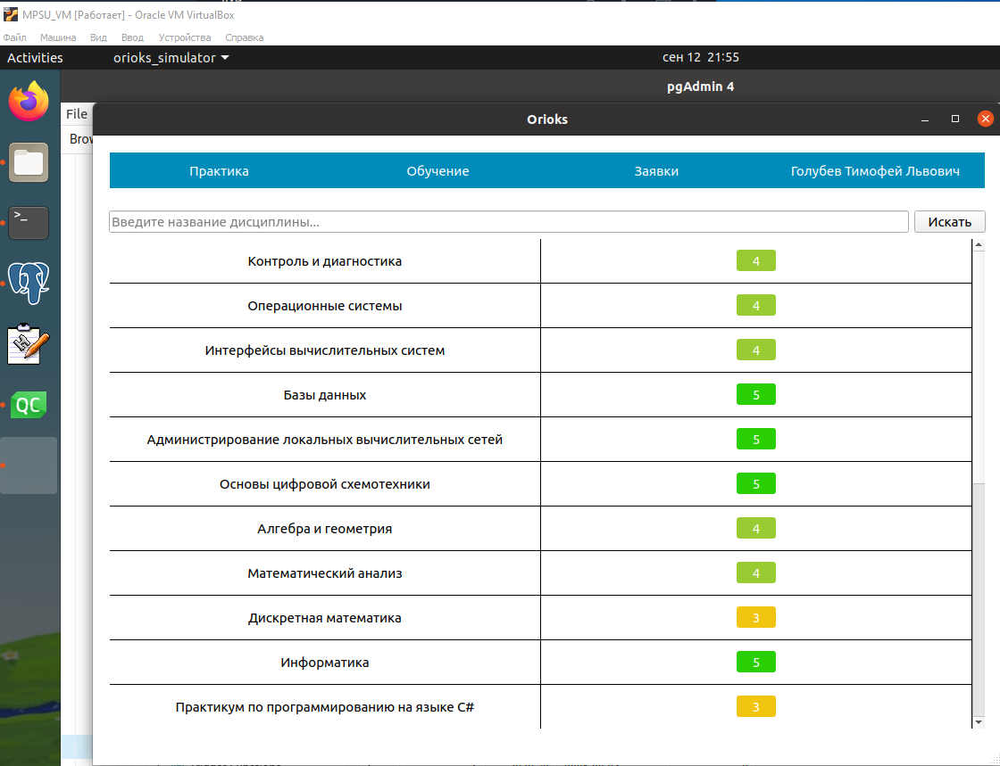
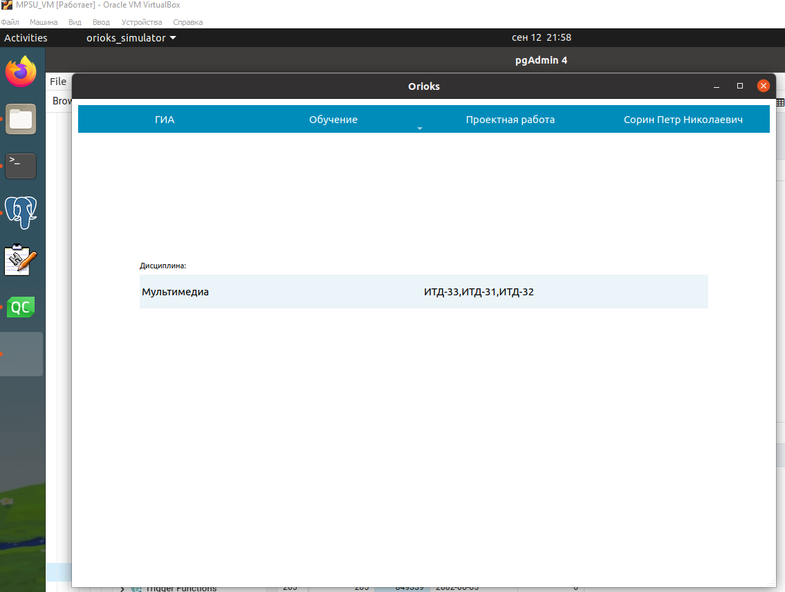
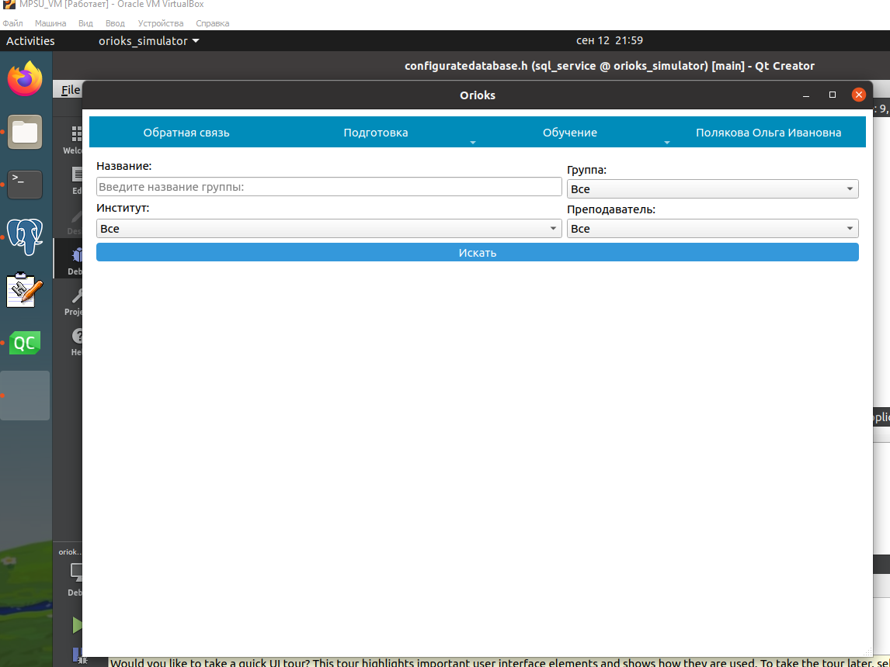
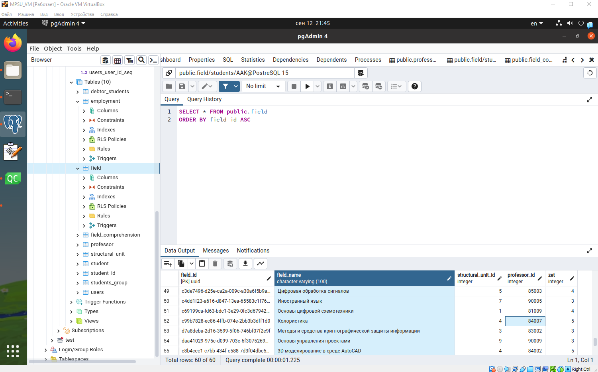
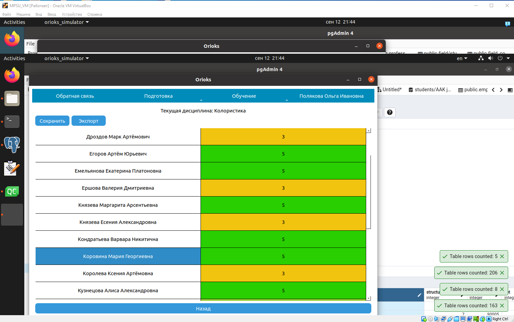

1. Задание 1.

    Создание базы данных

    create_db
    

    insert_students
    

    check_table
    

1. Задание 2.

    Работа с терминалом *psql*

    `\dt`
    

    `\dt+`
    
    Обратим внимание, что таблица `student` занимает `48 kB`.

    `\du`
    

    `\d student`
    

    Как я исправил роль на `AAK`
    

1. Задание 3.
    Изучение реляционной базы данных

    * Схема данных
      

    * Кол-во строк:
        1. `debtor_students` - 5
        1. `employment` - 42
        1. `field` - 60
        1. `field_compression` - 3810
        1. `professor` - 43
        1. `structural_unit` - 10
        1. `student` - 163
        1. `student_id` - 163
        1. `students_group` - 8
        1. `users` - 206

    Студбилет - подчиненная *студент*.
    Студент - главная для предмет *Рез освоения дисциплины* и *Студбилет*. Подчиненная для *студгруппа*.
    Группа - главная для *студент*.
    Структурное подразделение - главная для *Занятость*, *Дисциплина*, *Студгруппа*.
    Преподавател - главная для *Занятость*, *Дисциплина*.
    Дисциплина - главная для *рез освоения*, подчиненная *структурное подразделение*, *профессор*.
    Занятость - подчиненнось *Преподаватели*, *структурное подразделени*.
   
1. Задание 4.
    Работа с ролями в СУБД

    

    **Ответ**: не удалось

1. Задание 5.
    Работа с программой «ORIOKS Simulator»

    Если изменить пароль с предложенного при запуске, то получим сообщение
    >Неверный логи или пароль!

    Происходит подключение к базе данных *postgres*. Подключение успешно.
    Если подключение неуспешно, то выведет:
    ```cpp
    qDebug() << "Failed to connect to database.";
    qDebug() << "Error: ";
    ```

    Нужно поменять строки:
    ```cpp
    inline QString DATABASE_NAME = "orioks";
    inline QString USER_NAME = "postgres";
    ```

    На:
    ```cpp
    inline QString DATABASE_NAME = "students";
    inline QString USER_NAME = "AAK";
    ```

    Интерфейс от студента(год-месяц-день):
    

    Интерфейс от преподавателя:
    

    Интерфейс от методиста:
    

    Шаги, чтобы изменить оценку:
      1. В бд зайти в таблицу `field`.
      1. Найти предмет *Колористика*.
      1. Посмотреть, что `professor_id==84007`
      
      1. Зайти из под методиста в приложении.
      1. Выбрать найденного преподавателя по его *id*.
      1. Зайти в журнал и выбрать нужного ученика.
      1. поменять оценку.
      
