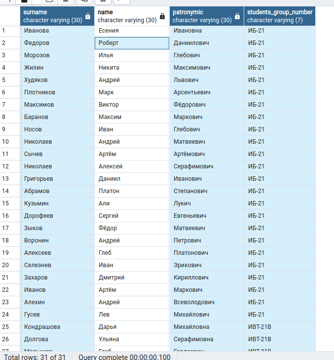
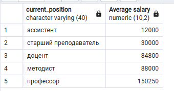
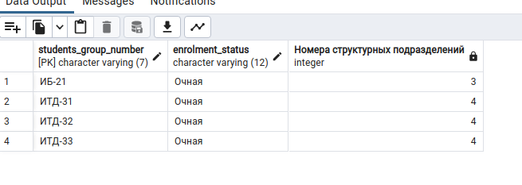
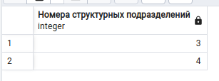
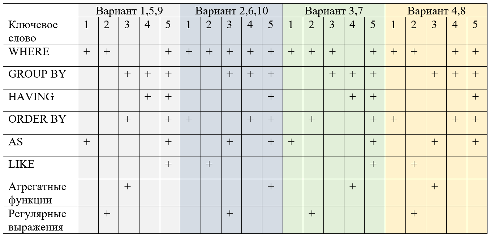
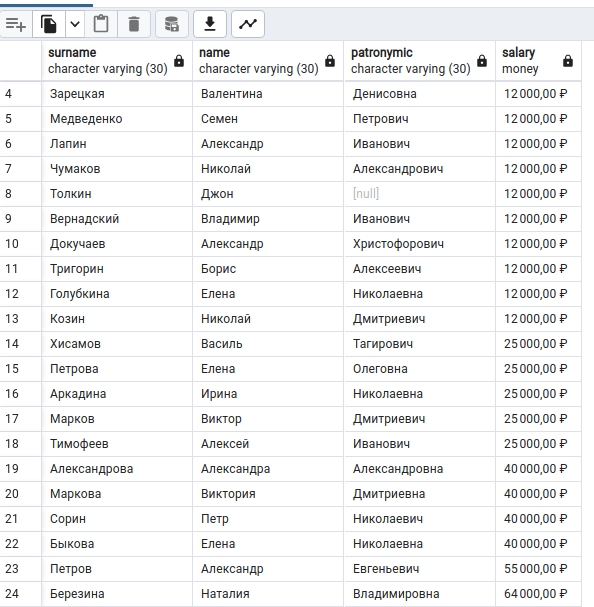
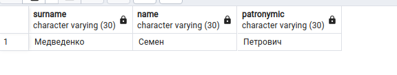
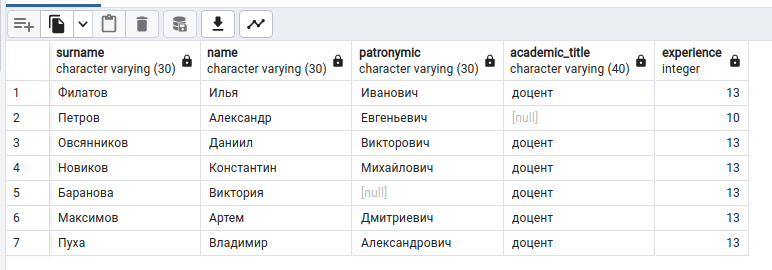
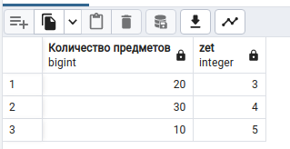
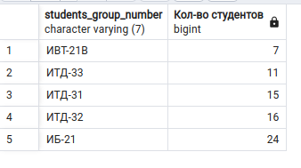

# Лабораторная работа 2

1.  ## Задание 1.

    *Исследование типов данных*

    > Предположим, что в магазине новый конструктор стоит 999 рублей и 9 копеек.
    > Студент С. решил приобрести для дальнейшей перепродажи 100000 таких товаров.
    > Обратите внимание, что значение суммы имеет тип *real*.
    >
    > ```pgsql
    > DO
    > $$
    > DECLARE
    >       summ real :=0.0;	
    > BEGIN
    > FOR i IN 1..100000 LOOP
    >   summ := summ + 999.99;
    > END LOOP;
    > RAISE NOTICE 'Summ = %;', summ;
    > --RAISE NOTICE 'Diff = %;', 99999000.00 - summ;
    > END
    > $$ language plpgsql;
    > ```
    >
    > Запустите скрипт. Раскомментируйте строку с вычислением разницы и определите,
    > сколько денег переплатил студент С? Объясните полученный результат.
    > Измените тип суммы на *numeric* и *money*. Какой результат был получен в обоих случаях?

    **Вывод**:

    ```
    NOTICE:  Summ = 9.999999e+07;
    NOTICE:  Diff = -992;
    DO

    Query returned successfully in 100 msec.
    ```

    Данное расхождение(*переплата*) было получено в результате округлений.

    *   При замене `summ numeric :=0.0;`:

        `Diff = 0.00;`

        ```
        NOTICE:  Summ = 99999000.00;
        NOTICE:  Diff = 0.00;
        DO

        Query returned successfully in 78 msec.
        ```
    *   При замене `summ money :=0.0;`:

        Получаем ошибку приведения типов.

        ```
        ERROR:  operator does not exist: money + numeric
        LINE 1: SELECT summ + 999.99
                            ^
        HINT:  No operator matches the given name and argument types. You might need to add explicit type casts.
        QUERY:  SELECT summ + 999.99
        ```

        Фиксим ошибку добавлением кастов к `money`:

        ```pgsql
        DO
        $$
        DECLARE
              summ money :=0.0;	
        BEGIN
        FOR i IN 1..100000 LOOP
          summ := summ + 999.99::money;
        END LOOP;
        RAISE NOTICE 'Summ = %;', summ;
        RAISE NOTICE 'Diff = %;', 99999000.00::money - summ;
        END
        $$ language plpgsql;
        ```

        **Вывод**:
        ```
        NOTICE:  Summ = 99 999 000,00 ₽;
        NOTICE:  Diff = 0,00 ₽;
        DO

        Query returned successfully in 94 msec.
        ```

        Можно заметить появление знака *денежной единицы*.

2.  ## Задание 2.

    > Напишите SQL запрос к учебной базе данных в соответствии с вариантом.
    >
    > ~~16%6==4~~
    >
    > Выведите всех студентов, обучающихся на 2 курсе (ФИО, номер группы)
    > (используйте регулярное выражение)

    ```pgsql
    SELECT surname, name, patronymic, students_group_number
      FROM student
      WHERE students_group_number ~ '-2'
    ```

    

3.  ## Задание 3.

    > Напишите SQL запрос к учебной базе данных в соответствии с вариантом.
    >
    > Посчитайте ср. Оклад по должностям, вывести в порядке возрастания.

    ```pgsql
    SELECT сurrent_position, AVG(salary::numeric)::numeric(10,2) AS "Average salary"
      FROM professor
      GROUP BY сurrent_position
      ORDER BY "Average salary";
    ```

    

4.  ## Задание 4.

    > Напишите SQL запросы к учебной базе данных в соответствии с вариантом.
    >
    > Вывести Номера Групп на Очном обучении и номера их структурных подразделений (больше 2),
    > переименовать столбец Номера структурных подразделений сгруппировать их и сортировать.

    *   Без группировки:

        ```pgsql
        SELECT students_group_number, enrolment_status, structural_unit_number AS "Номера структурных подразделений"
          FROM students_group
          WHERE enrolment_status = 'Очная' AND structural_unit_number > 2
          ORDER BY structural_unit_number
        ```

        
    *   С группировкой:

        ```pgsql
        SELECT structural_unit_number AS "Номера структурных подразделений"
          FROM students_group
          WHERE enrolment_status = 'Очная' AND structural_unit_number > 2
          GROUP BY structural_unit_number
          ORDER BY structural_unit_number
        ```

        

    Не получается одновременно выводить *номер группы* и группировать по
    *структурным подразделениям*.

5.  ## Задание 5.

    > Самостоятельно разработайте 5 осмысленных запросов к базе данных,
    > используя приведенные в данной лабораторной работе материалы.
    > Вариант выбирается в соответствии с номером по списку.
    >
    > 

    ~~16 % 10 == 6~~

    1.  > **WHERE**, **ORDER BY**

        > Вывести **ФИО**, **зп** *преподавателей*, у которых **зарплата** меньше средней зп по РФ (*65338*).
        > Сортировать по зп в порядке возрастания.

        ```pgsql
        SELECT surname, name, patronymic, salary
          FROM professor
          WHERE salary::numeric < 65338
          ORDER BY salary
        ```

        
    2.  > **WHERE**, **LIKE**

        > Вывести **ФИО** всех преподавателей, у которых фамилия начинается на *Ме*.

        ```pgsql
        SELECT surname, name, patronymic
          FROM professor
          WHERE surname LIKE 'Ме%'
        ```

        
    3.  > **WHERE**, **GROUP BY**, **AS**, **REGEX**

        > Вывести **ФИО**, **стаж**, и **академическую должность** всех преподавателей, у которых **стаж** от 10 до 20
        > лет включительно, используя регулярные выражения.

        ```pgsql
        SELECT surname, name, patronymic, academic_title, experience
          FROM professor
          WHERE experience::text ~ '(1\d|20)'
        ```

        
    4.  > **WHERE**, **GROUP BY**, **ORDER BY**

        > Подсчитать количество предметов по **zet**. Сортировать по **zet**. Вывести **количество предметов** и **zet**.

        ```pgsql
        SELECT count(*) as "Количество предметов", zet
          FROM field
          GROUP BY zet
          ORDER BY zet
        ```

        
    5.  > **WHERE**, **GROUP BY**, **HAVING**, **ORDER BY**, **AS**, **AGG**

        > Вывести **группы**, в которых больше 2ух студентов,
        > родившихся после *01/06/2002*(д/м/г). Также вывести **кол-во студентов** в каждой группе,
        > которые удовлетворяют запросу.

        ```pgsql
        SELECT students_group_number, count(*) as "Кол-во студентов"
          FROM student
          WHERE birthday > '01/06/2002'
          GROUP BY students_group_number
          HAVING count(*) > 2
          ORDER BY "Кол-во студентов"
        ```

        
