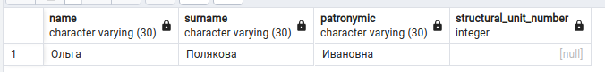

# Лабораторная работа 2

***[TOC]***
1.  [Задание 1](#задание-1)

---

*Вариант*: 16 % 6 == 4

1.  ## Задание 1.

    > | № варианта | Запрос                                                                                                          |
    > |------------|-----------------------------------------------------------------------------------------------------------------|
    > | 4          | Сделайте проверку, все ли преподаватели трудоустроены.                                                          |

    *   **КОД**:

        ```psql
        SELECT p.name, p.surname, p.patronymic, e.structural_unit_number
          FROM professor AS p
          LEFT OUTER JOIN employment AS e
          ON p.professor_id = e.professor_id
          WHERE e.structural_unit_number IS null
        ```

    *   **OUTPUT**:

        

    *   **ОТВЕТ**: Не все преподаватели трудоустроены.
