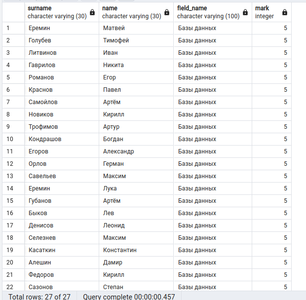
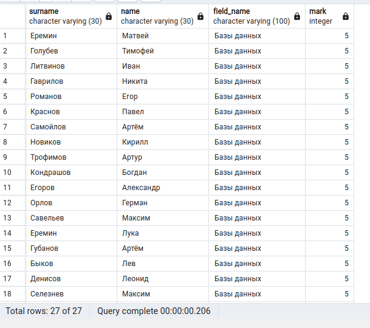
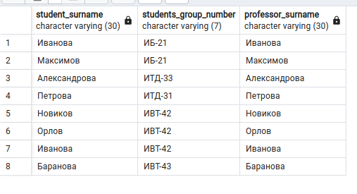
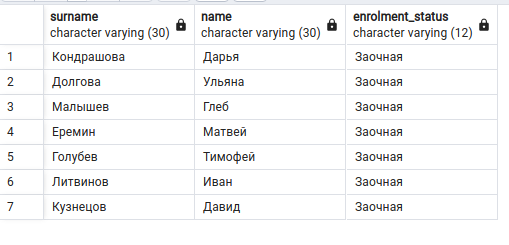

# Лабораторная работа 2

***[TOC]***
1.  [Задание 1](#задание-1)

---

*Вариант*: 16 % 6 == 4

1.  ## Задание 1.

    > | № варианта | Запрос                                                                                                          |
    > |------------|-----------------------------------------------------------------------------------------------------------------|
    > | 4          | Сделайте проверку, все ли преподаватели трудоустроены.                                                          |

    *   **КОД**:

        ```pgsql
        SELECT p.name, p.surname, p.patronymic, e.structural_unit_number
          FROM professor AS p
          LEFT OUTER JOIN employment AS e
          ON p.professor_id = e.professor_id
          WHERE e.structural_unit_number IS null
        ```

    *   **OUTPUT**:

        

    *   **ОТВЕТ**: Не все преподаватели трудоустроены.
2.  ## Задание 2.

    > Выведите Фамилии и Имена студентов, кто получил 5 по Базам данных.

    ~~Попытка 1:~~

    *   **КОД**:

        ```pgsql
        SELECT s.surname, s.name, f.field_name, fc.mark 
          FROM student AS s, field_comprehension AS fc, field AS f
          WHERE s.student_id = fc.student_id AND f.field_id = fc.field
          AND f.field_name ~ 'Базы данных' AND fc.mark = 5
        ```

    *   **OUTPUT**:

        

    Попытка 2:

    *   **КОД**:

        ```pgsql
        SELECT s.surname, s.name, f.field_name, fc.mark 
          FROM student AS s
          INNER JOIN field_comprehension AS fc
          ON s.student_id = fc.student_id
          INNER JOIN field AS f
          ON f.field_id = fc.field
          WHERE f.field_name ~ 'Базы данных' AND fc.mark = 5
        ```

    *   **OUTPUT**:

        

3.  ## Задание 3.

    > Выведите студента, его группу и преподавателя, у которого фамилия = фамилия студента.

    *   **КОД**:

        ```pgsql
        SELECT s.surname AS student_surname, s.students_group_number, p.surname AS professor_surname
          FROM student AS s
          INNER JOIN professor AS p
          ON s.surname = p.surname
        ```

    *   **OUTPUT**:

        

4.  ## Задание 4.

    > Выведите фамилию и имя всех студентов, кто учится заочно.

    *   **КОД**:

        ```pgsql
        SELECT s.surname, s.name, g.enrolment_status
          FROM student AS s
          INNER JOIN students_group AS g
          ON s.students_group_number = g.students_group_number
          WHERE g.enrolment_status ~ 'Заочная'
        ```

    *   **OUTPUT**:

        
