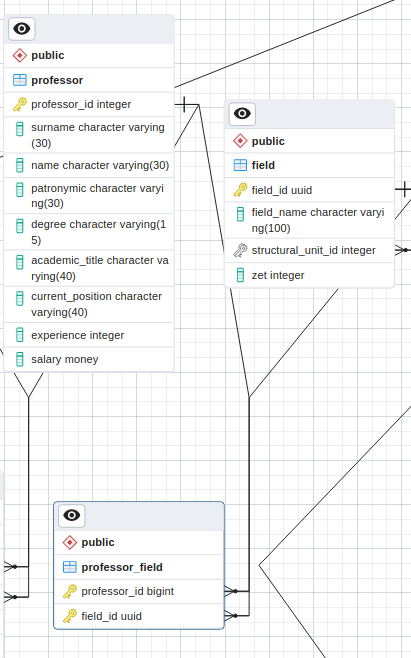

# Лабораторная работа 4

***[TOC]***
1.  [Задание 1](#задание-1)


---

1.  ## Задание 1.

    > В учебной базе данных одним из допущений является возможность прикрепить
    > только одного преподавателя к дисциплине. Исправьте его.

    *Задача формализованная*: Нужно преобразовать из *1:n* в *m:n*.
    
    Такое преобразование можно сделать, создав связь между таблицами.

    1.  Создадим **связь** *professor_field*, которая связывает *field* и *professor*.

        ```pgsql
        CREATE TABLE professor_field(
          professor_id BIGINT,
          field_id     UUID,
          
          CONSTRAINT professor_fkey
            FOREIGN KEY(professor_id) 
              REFERENCES professor(professor_id)
              ON DELETE CASCADE
        )
        ```

    1.  Установим аттрибуты *professor_id*, *field_id* в качестве **pkey**.

        ```pgsql
        ALTER TABLE professor_field ADD PRIMARY KEY (professor_id, field_id);
        ```

    1.  Копируем данные из таблицы *field* в таблицу *professor_field*.

        ```pgsql
        INSERT INTO professor_field (professor_id, field_id)
          SELECT professor_id, field_id FROM field;
        ```

    1.  Установим аттрибут *field_id* в качестве **fkey**.

        ```pgsql
        ALTER TABLE professor_field ADD FOREIGN KEY (field_id) REFERENCES field(field_id);
        ```

    1.  Удалим аттрибут *professor_id* у таблицы *field*.

        ```pgsql
        ALTER TABLE field
          DROP COLUMN professor_id;
        ```

    Таким образом *ER* диаграмма для таблиц *professor*, *field*, *professor_field*
    выглядит следующим образом:

    

2.  ## Задание 2.

    > Добавьте в таблицу Professor поле, содержащее его контактный телефон.
    > Сделайте ограничение, позволяющее хранить номер телефона в формате:
    > +7(XXX)XXX-XX-XX или 8(XXX)XXX-XX-XX

    **КОД**:

    ```pgsql
    ALTER TABLE professor
      ADD mobile_phone varchar(16)
      CONSTRAINT mobile_phone_rus_format
        CHECK (mobile_phone ~ '^(\+7|8)\(\d{3}\)\d{3}-\d{2}-\d{2}$');
    ```

3.  ## Задание 3.

    > Добавьте в таблицу *Students_group* поле, содержащее информацию о старосте.
    > Старостой группы может быть только один из студентов, обучающихся в ней.

    **ПЛАН**:

    Допустим мы решим выполнять через добавления **CONSTRAINT** на поле в *students_group*, чтобы
    сделать ограничение на группу старосты ~~возможно также сделать через *trigger* в *sql*~~

    Хорошо, если это поле будет **FOREIGN KEY** идентификатор студента,
    тк мы не хотим иметь проблем с поддержкой.

    Возникает циклическая зависимость между таблицами *students_group* и *student*
    (*номер группы* - **fkey** для *student* и **pkey** для *students_group*,
    а *номер студбилета* - **fkey** для *students_group* и **pkey** для *student*).
    Циклические зависимости создадут проблемы манипуляции данными.

    Решим следующим образом: создадим таблицу *chieftain*, которая будет содержать информацию
    о старосте группы. В ней будут колонки: *номер студбилета*, *номер группы*.

    1.  *номер студбилета*, *номер группы* - **fkey**, ссылается на *номер студбилета*,
        *номер группы* в *student*.
    1.  Также колонки *номер студбилета*, *номер группы* в *student* сделаем **UNIQUE**.
    1.  **PRIMARY KEY** - вся строка.
    1.  *номер группы* - **UNIQUE**.
    1.  *номер студбилета* - **UNIQUE**.

    Таким образом мы запрещаем вставлять несуществующие комбинации *номер студбилета*,
    *номер группы* и создаем автоматическую проверку на то, что студент из нужной группы.
    Нет циклических зависимостей.

    **ВЫПОЛНЕНИЕ**:

    1.  Сделаем колонки *student_id*, *students_group_number* в таблице *student* **UNIQUE**.

        ```pgsql
        ALTER TABLE student ADD UNIQUE (student_id, students_group_number);
        ```

    1.  Создаем таблицу *chieftain* с нужными **CONSTRAINT**.

        ```pgsql
        CREATE TABLE chieftain(
          student_id BIGINT NOT NULL,
          students_group_number VARCHAR(7) NOT NULL,
          PRIMARY KEY(student_id, students_group_number),
          FOREIGN KEY(student_id, students_group_number)
            REFERENCES student(student_id, students_group_number)
            ON DELETE CASCADE,
          UNIQUE(student_id),
          UNIQUE(students_group_number)
        );
        ```

    1.  Пробуем добавить валидную строку.

        

        ```pgsql
        INSERT INTO chieftain (student_id, students_group_number)
          VALUES              (813514,     'ИВТ-43');
        ```

        Получаем:

        ```
        INSERT 0 1
        ```

    1.  Пробуем добавить невалидную строку (студент не из той группы).

        ```pgsql
        INSERT INTO chieftain (student_id, students_group_number)
          VALUES              (815274,     'ИВТ-42');
        ```

        Получаем:

        ```
        ERROR:  insert or update on table "chieftain" violates foreign key constraint "chieftain_student_id_students_group_number_fkey"
        DETAIL:  Key (student_id, students_group_number)=(815274, ИВТ-42) is not present in table "student".
        SQL state: 23503
        ```

    Задание выполнено.

4.  ## Задание 4.

    > В соответствии с вариантом доработайте базу данных.
    > Вариант выбирается в соответствии с формулой: `N = (N_в_списке mod 10) + 1`.
    > При доработке БД должно быть добавлено не менее трех новых таблиц.

    *Вариант*: 7

    >	Добавить возможность получения студентами льгот и стипендии

    Проработаем задание на *логическом уровне*.

    **ER-диаграмма**:

    

    **КОД НА DBML**:

    ```dbml
    Table student {
      student_id            integer       [primary key]
      surname               character(30)
      name                  character(30)
      patronymic            character(30)
      students_group_number character(7)
      birthday              date
      email                 character(30) [unique]
      scholarship_id        integer
    }

    Table scholarship {
      scholarship_id serial [primary key]
      condition      text
      sum            money  [not null]
    }

    Table student_privilege {
      privilege_id   integer
      student_id     integer

      Indexes {
        (privilege_id, student_id) [pk]
      }
    }

    Table privilege {
      privilege_id serial [primary key]
      effect       text
      condition    text
      sum          money  [null]
    }

    Ref: student.student_id             < student_privilege.student_id
    Ref: student_privilege.privilege_id > privilege.privilege_id

    Ref: student.scholarship_id > scholarship.scholarship_id
    ```

5.  ## Задание 5.

    > В соответствии с вариантом доработайте физическую модель базы данных в СУБД PostgreSQL.

    На основе [задания 4](#задание-4) доработаем модель.

    1.  Создаем таблицу *scholarship*:

        ```pgsql
        CREATE TABLE scholarship(
          scholarship_id SERIAL,
          condition      TEXT,
          sum            MONEY NOT null,

          PRIMARY KEY(scholarship_id)
        );
        ```

    2.  Создаем таблицу *privilege*:

        ```pgsql
        CREATE TABLE privilege(
          privilege_id SERIAL,
          effect       TEXT,
          condition    TEXT,
          sum          MONEY,

          PRIMARY KEY(privilege_id)
        );
        ```

    3.  Создаем таблицу *student_privilege*:

        ```pgsql
        CREATE TABLE student_privilege(
          privilege_id INTEGER,
          student_id   INTEGER,

          PRIMARY KEY(privilege_id, student_id),
          FOREIGN KEY(privilege_id)
            REFERENCES privilege(privilege_id)
            ON DELETE CASCADE,
          FOREIGN KEY(student_id)
            REFERENCES student(student_id)
            ON DELETE CASCADE
        );
        ```

    4.  Добавляем столбец *scholarship_id* в таблицу *student*:

        ```pgsql
        ALTER TABLE student
          ADD scholarship_id INTEGER
        ```

        И устанавливаем **CONSTRAINT** на этот столбец:

        ```pgsql
        ALTER TABLE student
          ADD FOREIGN KEY(scholarship_id)
            REFERENCES scholarship(scholarship_id)
            ON DELETE CASCADE
        ```
