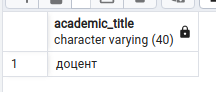
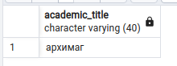
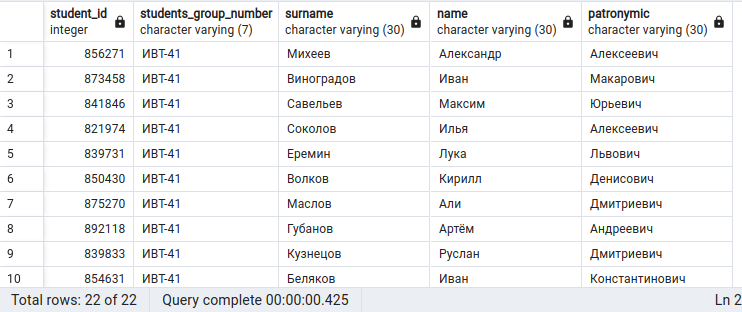
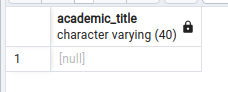

# Лабораторная работа №7 по БД

## Выбор варианта

16 % 5 == 1 (+1)

1.  ## Задание 1

    > Напишите скрипт, в результате работы которого будет выведено ФИО преподавателя,
    > его ставка и реальная занятость – сумма ЗЕТ всех читаемых им дисциплин

    **КОД**:

    ```pgsql
    do
    $$
    DECLARE
      professor record;
    BEGIN
      FOR professor IN
        SELECT p.surname, p.name, p.patronymic, e.wage_rate, SUM(f.zet) AS zet
          FROM professor AS p
          INNER JOIN employment AS e ON p.professor_id = e.professor_id
          INNER JOIN field AS f ON f.professor_id = p.professor_id
          GROUP BY p.professor_id, e.wage_rate
      loop
        raise notice 'ФИО: % % %', professor.surname, professor.name, professor.patronymic;
        raise notice 'ставка: %', professor.wage_rate;
        raise notice 'реальная занятость: %', professor.zet;
		raise notice '';
      end loop;
    END
    $$;
    ```

    **OUTPUT**:

    ```
    NOTICE:  ФИО: Хисамов Василь Тагирович
    NOTICE:  ставка: 1.50
    NOTICE:  реальная занятость: 8
    NOTICE:
    NOTICE:  ФИО: Лазарева Мария Викторовна
    NOTICE:  ставка: 0.60
    NOTICE:  реальная занятость: 12
    NOTICE:
    NOTICE:  ФИО: Сорин Петр Николаевич
    NOTICE:  ставка: 0.25
    NOTICE:  реальная занятость: 5
    ...
    ```

2.  ## Задание 2

    > Создайте процедуру добавления/изменения ученого звания у преподавателя

    **ПРОЦЕДУРА**:

    ```pgsql
    CREATE OR REPLACE PROCEDURE set_academic_title(professor_id_ bigint, academic_title_ varchar(40))
      LANGUAGE SQL
      AS $$
      UPDATE professor
        SET academic_title = academic_title_
        WHERE professor_id = professor_id_;
      $$;
    ```

    Выведем *ученое звание* у `professor_id = 81001` *ДО* вызова процедуры:

    **КОД**:

    ```sql
    SELECT academic_title
      FROM professor
      WHERE professor_id = 81001
    ```

    **OUTPUT**:

    

    Выполним процедуру с помощью скрипта:

    ```pgsql
    do
    $$
    BEGIN
      CALL set_academic_title(81001, 'архимаг');
    END
    $$;
    ```

    Выведем *ученое звание* у `professor_id = 81001` *ПОСЛЕ* вызова процедуры:

    **КОД**:

    ```sql
    SELECT academic_title
      FROM professor
      WHERE professor_id = 81001
    ```

    **OUTPUT**:

    

3.  ## Задание 3

    > Сделайте функцию, которая выводит всех студентов по определенной группе

    **СОСТАВНОЙ ТИП *student_t***:

    ```pgsql
    CREATE TYPE student_t AS(
      student_id            INTEGER,
      students_group_number VARCHAR(7),
      surname               VARCHAR(30),
      name                  VARCHAR(30),
      patronymic            VARCHAR(30)
    );
    ```

    **ФУНКЦИЯ**:

    ```pgsql
    CREATE OR REPLACE FUNCTION select_students(students_group_number_ VARCHAR(7)) RETURNS SETOF student_t
      LANGUAGE SQL
      AS $$
      SELECT student_id, students_group_number, surname, name, patronymic
        FROM student
        WHERE students_group_number = students_group_number_
      $$;
    ```

    Выведем студентов группы *ИВТ-41*:

    **КОД**:

    ```pgsql
    SELECT *
      FROM select_students('ИВТ-41')
    ```

    **OUTPUT**:

    

4.  ## Задание 4

    > Создайте процедуру удаления ученого звания

    **ПРОЦЕДУРА**:

    ```pgsql
    CREATE OR REPLACE PROCEDURE del_academic_title(professor_id_ bigint)
      LANGUAGE SQL
      AS $$
      UPDATE professor
        SET academic_title = NULL
        WHERE professor_id = professor_id_;
      $$;
    ```

    Выполним процедуру с помощью скрипта:

    ```pgsql
    do
    $$
    BEGIN
      CALL del_academic_title(81001);
    END
    $$;
    ```

    Выведем *ученое звание* у `professor_id = 81001` *ПОСЛЕ* вызова процедуры:

    **КОД**:

    ```sql
    SELECT academic_title
      FROM professor
      WHERE professor_id = 81001
    ```

    **OUTPUT**:

    

5.  ## Задание 5
