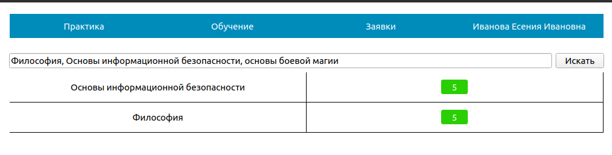

# Лабораторная работа №8 по БД

1.  ## Задание 1

    > Ознакомьтесь с функцией searchBySubject() класса Diary, реализующей поиск
    > введенной дисциплины в списке предметов студента. Модифицируйте функцию поиска
    > так, чтобы можно было искать сразу несколько предметов (предметы вводятся в строку
    > поиска через запятую). В случае, если один или несколько из введенных предметов не
    > существует в базе данных, вывести на экран только те предметы, которые есть в дневнике
    > студента.

    Перепишем функцию `searchBySubject()` следующим образом:

    ```cpp
    void Diary::searchBySubject()
    {
        // Эта функция - демонстрация возможности SQL иньекции.
        // См ЛР. 8 или ChatGPT

        QSqlQuery search_query;
        /*QString query = "select field_name, mark FROM field_comprehension "
                        "LEFT OUTER JOIN Field "
                        "ON Field_comprehension.field = Field.field_id "
                        "where student_id =" + QString::number(current_student_.getUserId()) + " AND field_name = '" + QString(ui->search_line->text()) + "'";
        search_query.exec(query);*/

        QString query{"select field_name, mark FROM field_comprehension "
                "LEFT OUTER JOIN Field "
                "ON Field_comprehension.field = Field.field_id "
                "where student_id = :id AND field_name IN ("};

        query = query + prepareSubjects(ui->search_line->text()) + ")";

        search_query.prepare(query);
        search_query.bindValue(":id", current_student_.getUserId());

        search_query.exec();

        if (search_query.size() == 0) {
            ui->search_line->clear();
            ui->search_line->setPlaceholderText("Предметы не найдены!");
        } else {
            fillDiaryMarks(std::move(search_query));
        }
    }
    ```

    Добавим функцию `trim`:

    ```cpp
    inline std::string trim(std::string str)
    {
        std::string white{" \t\n\r\f\v"};
        str.erase(str.find_last_not_of(white)+1);         //suffixing spaces
        str.erase(0, str.find_first_not_of(white));       //prefixing spaces
        return str;
    }
    ```

    Добавим функцию `prepareSubjects`:

    ```cpp
    QString prepareSubjects(QString initial_subject_str) {
        std::stringstream ss(initial_subject_str.toStdString());
        std::string token, result;

        while(std::getline(ss, token, ',')) {
            // Remove spaces
            token = trim(token);
            result += "'" + token + "', ";
        }

        // Remove the last comma and space
        result = result.substr(0, result.length()-2);

        return QString::fromStdString(result);
    }
    ```

    Тестовый студент:

    | Логин  | Пароль     |
    | ------ | ---------- |
    | 838389 | 2003-12-23 |

    

    Строка запроса (`Философия, Основы информационной безопасности, основы боевой магии`)
    после обработки функцией `searchBySubject()` будет выглядеть следующим образом:

    ```sql
    ...
    where student_id = :id AND field_name IN ('Философия', 'Основы информационной безопасности', 'основы боевой магии')
    ```

2.  ## Задание 2

    > Реализуйте защиту от SQL-инъекции для строки поиска предмета. В случае
    > попытки SQL - инъекции программа должна работать в штатном режиме с возможностью
    > продолжать поиск предметов.

    Изменим фукнцию `prepareSubjects`:

    ```cpp
    QString prepareSubjects(QString initial_subject_qstr) {
        std::string initial_subject_str{initial_subject_qstr.toStdString()};
        CorrectApostrof(initial_subject_str);
        std::stringstream ss(initial_subject_str);
        std::string token, result;

        while(std::getline(ss, token, ',')) {
            // Remove spaces
            token = trim(token);
            result += "'" + token + "', ";
        }

        // Remove the last comma and space
        result = result.substr(0, result.length()-2);

        return QString::fromStdString(result);
    }
    ```

    И добавим предложенную в лабораторной работе фукнкцию `CorrectApostrof`:

    ```cpp
    void CorrectApostrof(std::string &query)
    {
    size_t pos;
      while ((pos = query.find('\'')) != std::string::npos) {
        query.replace(pos, 1, "`");
      }
    }
    ```

    Примеры SQL-инъекций, которые ломали БД до введения защиты:
    1.  ```sql
        ') OR 1=1; --'
        ```

        Данная строка в поиске приводила к тому, что отображались все оценки.
    1.  ```sql
        '1' OR 1=1; update field_comprehension set mark = 5 where student_id=856271 ;--'
        ```

        Строка из теории к лабе.
